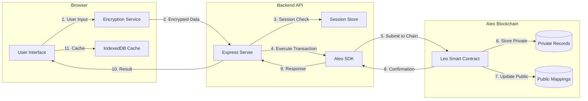
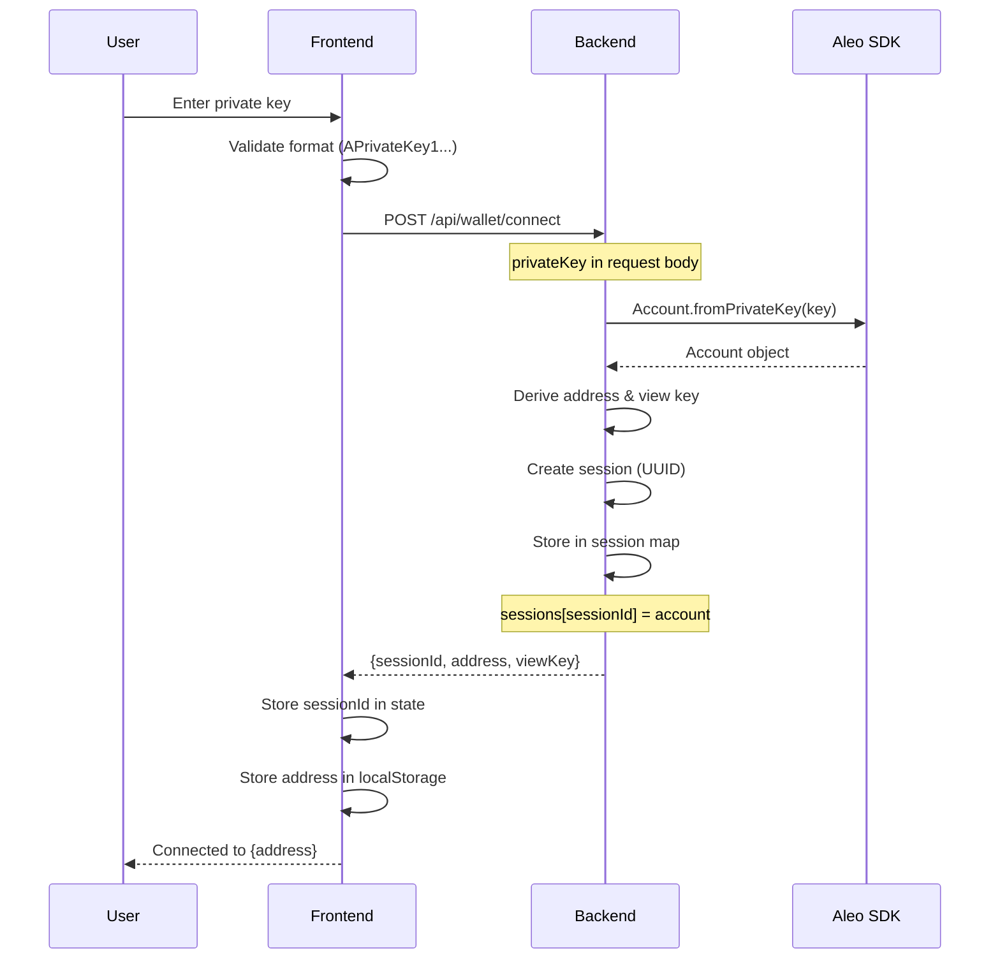
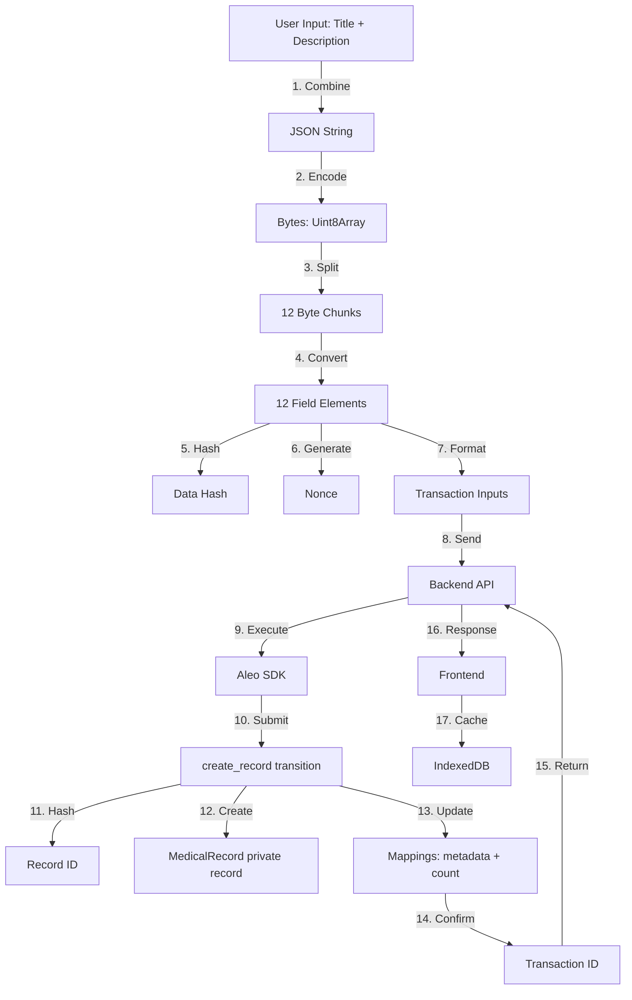
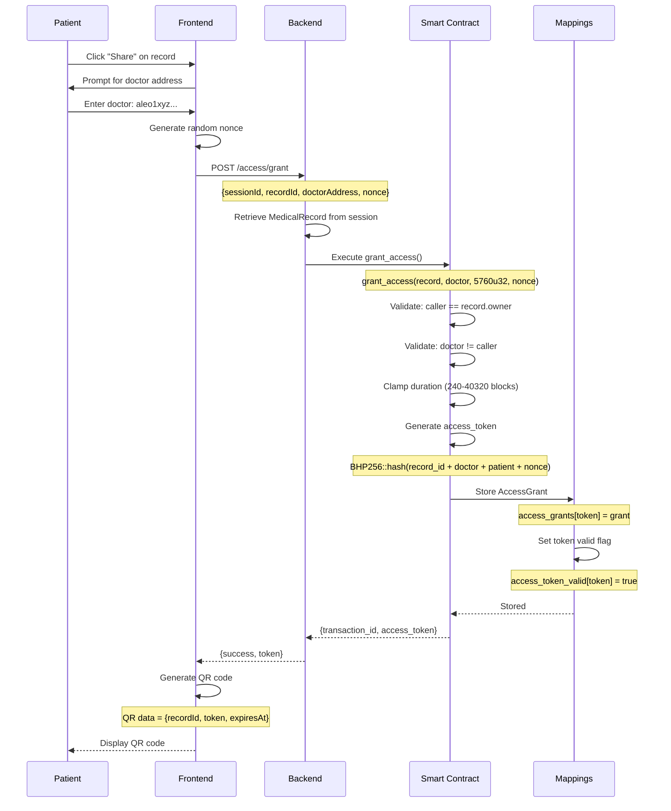
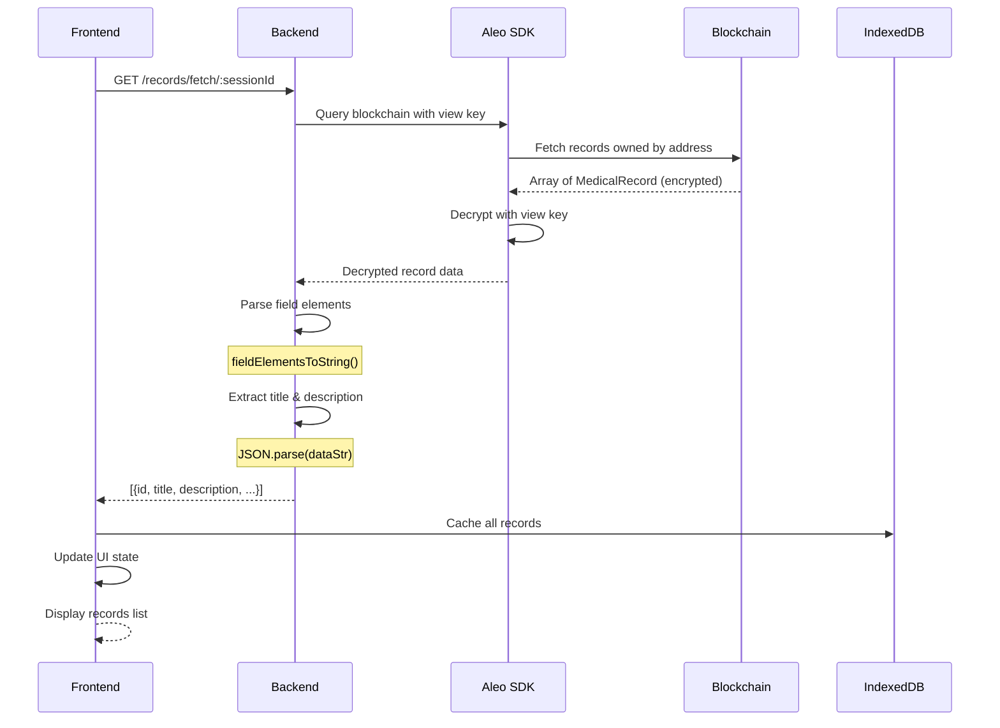

## Overview

This document describes the complete data flow for all major operations in Salud Health, from user interaction to blockchain storage.

## System Data Flow Diagram



## 1. Wallet Connection Flow

### Patient Connects Wallet



**Data Transformation:**

```typescript
// Input
privateKey: "APrivateKey1zkp..."

// Backend Processing
const account = Account.fromPrivateKey(privateKey);
const sessionId = generateUUID(); // "550e8400-e29b-41d4-a716-446655440000"
const address = account.address().toString(); // "aleo1..."
const viewKey = account.viewKey().toString(); // "AViewKey1..."

// Output
{
  sessionId: "550e8400-e29b-41d4-a716-446655440000",
  address: "aleo1gl4a57rcxyjvmzcgjscjqe466ecdr7uk4gdp7sf5pctu6tjvv5qs60lw8y",
  viewKey: "AViewKey1..."
}
```

## 2. Create Medical Record Flow

### Complete Data Pipeline



### Step-by-Step Data Transformation

#### Step 1: User Input → JSON

```typescript
// Frontend: src/lib/aleo-utils.ts:124
function createRecordData(title: string, description: string): string {
  return JSON.stringify({
    t: title,
    d: description
  });
}

// Example
Input:
  title: "Annual Checkup 2024"
  description: "Blood pressure: 120/80, Heart rate: 72 bpm, No issues detected"

Output:
  '{"t":"Annual Checkup 2024","d":"Blood pressure: 120/80, Heart rate: 72 bpm, No issues detected"}'
```

#### Step 2: String → Field Elements

```typescript
// Frontend: src/lib/aleo-utils.ts:16
function stringToFieldElements(data: string): string[] {
  const encoder = new TextEncoder();
  const bytes = encoder.encode(data); // UTF-8 bytes
  
  const fields: string[] = [];
  const BYTES_PER_FIELD = 30; // ~253 bits per field
  const NUM_FIELD_PARTS = 12; // Total fields (v6 contract)
  
  for (let i = 0; i < NUM_FIELD_PARTS; i++) {
    const start = i * BYTES_PER_FIELD;
    const end = Math.min(start + BYTES_PER_FIELD, bytes.length);
    const part = bytes.slice(start, end);
    fields.push(bytesToField(part)); // Convert to "123456field"
  }
  
  while (fields.length < NUM_FIELD_PARTS) {
    fields.push('0field'); // Pad remaining
  }
  
  return fields;
}

// Example Output
[
  "123456789012345678901234567890field",  // data_part1
  "987654321098765432109876543210field",  // data_part2
  "456789012345678901234567890123field",  // data_part3
  // ... 9 more parts
  "0field",  // data_part12 (padding if data < 360 bytes)
]
```

#### Step 3: Generate Hash and Nonce

```typescript
// Hash data for integrity verification
// Frontend: src/lib/aleo-utils.ts:92
function hashData(data: string): string {
  const encoder = new TextEncoder();
  const bytes = encoder.encode(data);
  
  let hash = BigInt(0);
  for (let i = 0; i < bytes.length; i++) {
    hash = hash + BigInt(bytes[i]) * BigInt(i + 1);
  }
  hash = hash * BigInt(31) + BigInt(17);
  
  return `${hash.toString()}field`;
}

// Generate cryptographically random nonce
// Frontend: src/lib/aleo-utils.ts:108
function generateNonce(): string {
  const randomBytes = new Uint8Array(16);
  crypto.getRandomValues(randomBytes); // Browser crypto API
  
  let nonce = BigInt(0);
  for (let i = 0; i < randomBytes.length; i++) {
    nonce = (nonce << BigInt(8)) | BigInt(randomBytes[i]);
  }
  
  return `${nonce.toString()}field`;
}

// Example
data_hash: "1234567890123456789field"
nonce: "98765432109876543210987654321field"
```

#### Step 4: Backend Transaction Execution

```typescript
// Backend: Prepare transaction
const inputs = [
  dataPart1, dataPart2, dataPart3, dataPart4,
  dataPart5, dataPart6, dataPart7, dataPart8,
  dataPart9, dataPart10, dataPart11, dataPart12,
  `${recordType}u8`,        // e.g., "1u8" for General Health
  dataHash,                 // "1234567890123456789field"
  nonce,                    // Random field element
  makeDiscoverable ? 'true' : 'false'
];

const transaction = await aleoSDK.execute(
  'salud_health_records_v6.aleo',
  'create_record',
  inputs,
  account.privateKey()
);
```

#### Step 5: Smart Contract Processing

```leo
// Contract: src/main.leo:163
async transition create_record(
    data_part1: field,
    // ... data_part2-12
    record_type: u8,
    data_hash: field,
    nonce: field,
    make_discoverable: bool
) -> (MedicalRecord, Future) {
    // 1. Validate record type
    assert(record_type >= 1u8 && record_type <= 10u8);
    
    // 2. Generate unique record ID
    let record_id: field = BHP256::hash_to_field(RecordIdInput {
        patient: self.caller,
        data_hash: data_hash,
        nonce: nonce,
    });
    
    // 3. Create private record (owned by patient)
    let medical_record: MedicalRecord = MedicalRecord {
        owner: self.caller,
        record_id: record_id,
        data_hash: data_hash,
        data_part1: data_part1,
        // ... data_part2-12
        record_type: record_type,
        created_at: 0u32,
        version: 1u8,
    };
    
    // 4. Return record + async finalize
    return (medical_record, finalize_create_record(...));
}

// 5. Update public mappings
async function finalize_create_record(
    patient: address,
    record_id: field,
    record_type: u8,
    make_discoverable: bool
) {
    // Increment patient's record count
    let count = patient_record_count.get_or_use(patient as field, 0u64);
    patient_record_count.set(patient as field, count + 1u64);
    
    // Optionally add to public index
    if make_discoverable {
        record_metadata.set(record_id, RecordMetadata {
            patient: patient,
            record_id: record_id,
            record_type: record_type,
            created_at: block.height,
            is_active: true,
        });
    }
}
```

#### Step 6: Response & Caching

```typescript
// Backend response
{
  success: true,
  data: {
    transactionId: "at1...",
    recordId: "1234567890123456789field"
  }
}

// Frontend caches in IndexedDB
const cachedRecord = {
  id: generateLocalId(),
  recordId: "1234567890123456789field",
  title: "Annual Checkup 2024",
  description: "Blood pressure: 120/80...",
  recordType: 1,
  createdAt: new Date().toISOString(),
  ownerAddress: userAddress,
  isEncrypted: false,
};

await db.records.add(cachedRecord);
```

## 3. Grant Access Flow

### Access Token Generation Pipeline



### Access Token Data Structure

```typescript
// QR Code Payload
interface QRCodeData {
  recordId: string;      // "1234567890field"
  accessToken: string;   // "9876543210field"
  expiresAt: number;     // Block height: 12345
  patientAddress: string; // "aleo1..."
}

// On-Chain AccessGrant (stored in public mapping)
struct AccessGrant {
  patient: address;      // aleo1abc...
  doctor: address;       // aleo1xyz...
  record_id: field;      // 1234567890field
  access_token: field;   // 9876543210field (hash of above + nonce)
  granted_at: u32;       // Block height when granted: 10000
  expires_at: u32;       // Block height when expires: 15760 (24h later)
  is_revoked: bool;      // false
}
```

## 4. Doctor Access Verification Flow

```mermaid
graph TD
    A[Doctor Scans QR Code] -->|Parse JSON| B{Valid Format?}
    B -->|No| C[Show Error]
    B -->|Yes| D[Extract: recordId, token, expiresAt]
    D --> E[Frontend: Check expiration locally]
    E -->|Expired| F[Show "Access Expired"]
    E -->|Valid| G[Backend: POST /access/verify]
    G --> H[Smart Contract: verify_access]
    
    H --> I{Token Exists?}
    I -->|No| J[Assertion Failed]
    I -->|Yes| K{Doctor Matches?}
    K -->|No| J
    K -->|Yes| L{Record ID Matches?}
    L -->|No| J
    L -->|Yes| M{Not Revoked?}
    M -->|No| J
    M -->|Yes| N{Not Expired?}
    N -->|No| J
    N -->|Yes| O[All Assertions Pass]
    
    J --> P[Transaction Fails]
    O --> Q[Transaction Succeeds]
    
    P --> R[Frontend: Show "Access Denied"]
    Q --> S[Frontend: Fetch & Decrypt Record]
    S --> T[Display Medical Data to Doctor]
```

### Verification Logic (Smart Contract)

```leo
// Contract: src/main.leo:342
async transition verify_access(
    access_token: field,
    doctor: address,
    record_id: field
) -> Future {
    return finalize_verify_access(access_token, doctor, record_id);
}

async function finalize_verify_access(
    access_token: field,
    doctor: address,
    record_id: field
) {
    // Step 1: Check token exists
    let is_valid: bool = access_token_valid.get_or_use(access_token, false);
    assert(is_valid); // ❌ Fails if token not found
    
    // Step 2: Get full grant details
    let grant: AccessGrant = access_grants.get(access_token);
    
    // Step 3: Verify doctor address
    assert_eq(grant.doctor, doctor); // ❌ Fails if wrong doctor
    
    // Step 4: Verify record ID
    assert_eq(grant.record_id, record_id); // ❌ Fails if wrong record
    
    // Step 5: Check not revoked
    assert(!grant.is_revoked); // ❌ Fails if revoked
    
    // Step 6: Check not expired
    assert(block.height <= grant.expires_at); // ❌ Fails if expired
    
    // ✅ All checks pass - transaction succeeds
}
```

## 5. Record Fetching Flow

### Blockchain → Frontend Pipeline



### Field Element Decoding

```typescript
// Backend: Convert 12 field elements → string
function fieldElementsToString(fields: string[]): string {
  const allBytes: number[] = [];
  
  for (const fieldStr of fields) {
    // "123456field" → 123456n (BigInt)
    const valueStr = fieldStr.replace('field', '');
    if (valueStr === '0') continue; // Skip padding
    
    let value = BigInt(valueStr);
    const bytes: number[] = [];
    
    // Convert BigInt → bytes
    while (value > 0n) {
      bytes.unshift(Number(value & 0xFFn));
      value = value >> 8n;
    }
    
    allBytes.push(...bytes);
  }
  
  // bytes → UTF-8 string
  const decoder = new TextDecoder();
  return decoder.decode(new Uint8Array(allBytes));
}

// Example
Input: [
  "123456789012345678901234567890field",
  "987654321098765432109876543210field",
  "0field", // padding
  // ... more fields
]

Output: '{"t":"Annual Checkup 2024","d":"Blood pressure: 120/80..."}'

// Then parse JSON
const parsed = JSON.parse(output);
// { t: "Annual Checkup 2024", d: "Blood pressure: 120/80..." }
```

## Data Flow Summary

### Operation Comparison

| Operation | Frontend → Backend | Backend → Blockchain | Blockchain Storage | Response Time |
|-----------|-------------------|---------------------|-------------------|---------------|
| **Connect Wallet** | Private key | Derive account | None | Less than 1s |
| **Create Record** | 12 fields + metadata | Execute create_record | Private record + mappings | ~15s (1 block) |
| **Grant Access** | recordId + doctor | Execute grant_access | AccessGrant mapping | ~15s |
| **Verify Access** | token + doctor | Execute verify_access | Read-only | ~15s |
| **Fetch Records** | sessionId | Query with view key | Read private records | 5-10s |
| **Revoke Access** | accessToken | Execute revoke_access | Update mapping | ~15s |

### Data Size Limits

```
┌─────────────────────────────────────────┐
│ Medical Record Storage Capacity         │
├─────────────────────────────────────────┤
│ Field Elements: 12                      │
│ Bytes per Field: ~30                    │
│ Total Capacity: ~360 bytes              │
│                                         │
│ Suitable for:                           │
│ ✅ Prescriptions (~200 bytes)           │
│ ✅ Lab results (~300 bytes)             │
│ ✅ Vaccination records (~150 bytes)     │
│ ✅ Basic medical notes (~350 bytes)     │
│                                         │
│ Not suitable for:                       │
│ ❌ X-ray images (MBs)                   │
│ ❌ Full medical history (KBs)           │
│ ❌ Lengthy diagnoses (>360 bytes)       │
│                                         │
│ Solution: Use multiple records or       │
│ off-chain storage (IPFS) with on-chain │
│ hash for large data                     │
└─────────────────────────────────────────┘
```

## Performance Optimization

### Frontend Caching Strategy

```typescript
// On initial load
1. Check IndexedDB for cached records
2. Display cached records immediately (fast UX)
3. Fetch from blockchain in background
4. Update cache with latest data
5. Refresh UI if changes detected

// On record creation
1. Submit transaction
2. Immediately add to cache (optimistic UI)
3. Wait for blockchain confirmation
4. Update cache with final recordId
5. Show success notification
```

### Backend Session Management

```typescript
// In-memory session store
const sessions = new Map<string, {
  account: Account,
  address: string,
  viewKey: string,
  createdAt: number,
}>;

// Auto-cleanup after 24 hours
setInterval(() => {
  const now = Date.now();
  for (const [id, session] of sessions) {
    if (now - session.createdAt > 24 * 60 * 60 * 1000) {
      sessions.delete(id);
    }
  }
}, 60 * 60 * 1000); // Check every hour
```

## Next Steps

<CardGroup cols={2}>
  <Card title="Encryption Details" href="/architecture/encryption" icon="shield-halved">
    Deep dive into encryption implementation
  </Card>
  <Card title="Smart Contract" href="/smart-contract/overview" icon="file-contract">
    Leo smart contract documentation
  </Card>
</CardGroup>