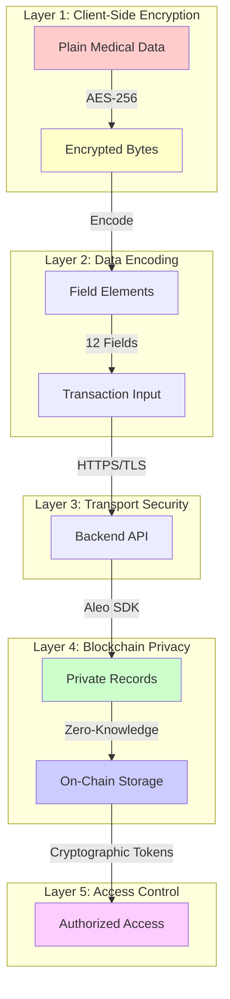
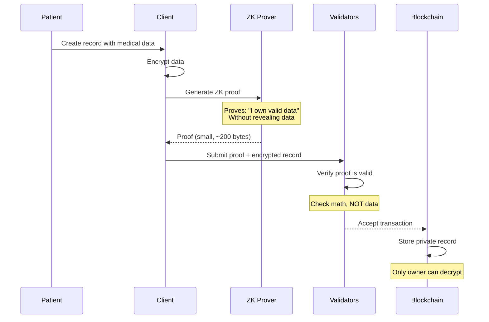
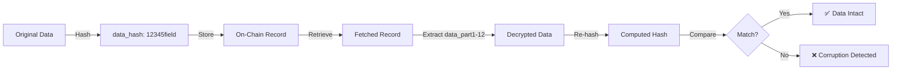

## Encryption Architecture

Salud Health implements **defense-in-depth** security with multiple layers of encryption and privacy protection. Medical data is encrypted end-to-end, leveraging Aleo's zero-knowledge architecture for maximum privacy.

## Multi-Layer Privacy Model



## Layer 1: Client-Side Encryption

### Current Implementation (Simplified)

**Note:** The current MVP uses basic encoding for demonstration. Production deployment should implement proper encryption.

```typescript
// Frontend: src/lib/aleo-utils.ts

/**
 * Convert medical data string to field elements
 * 
 * Process:
 * 1. UTF-8 encode the string
 * 2. Split into 30-byte chunks (Aleo field capacity)
 * 3. Convert each chunk to BigInt
 * 4. Format as "<number>field"
 */
function stringToFieldElements(data: string): string[] {
  const encoder = new TextEncoder();
  const bytes = encoder.encode(data); // UTF-8 encoding
  
  const fields: string[] = [];
  const BYTES_PER_FIELD = 30; // ~253 bits max per field
  const NUM_FIELD_PARTS = 12; // Total fields in v6 contract
  
  for (let i = 0; i < NUM_FIELD_PARTS; i++) {
    const start = i * BYTES_PER_FIELD;
    const end = Math.min(start + BYTES_PER_FIELD, bytes.length);
    const chunk = bytes.slice(start, end);
    
    fields.push(bytesToField(chunk));
  }
  
  // Pad remaining fields with zeros
  while (fields.length < NUM_FIELD_PARTS) {
    fields.push('0field');
  }
  
  return fields;
}

/**
 * Convert bytes to Aleo field element
 */
function bytesToField(bytes: Uint8Array): string {
  if (bytes.length === 0) return '0field';
  
  // Convert bytes to BigInt
  let value = BigInt(0);
  for (let i = 0; i < bytes.length; i++) {
    value = (value << BigInt(8)) | BigInt(bytes[i]);
  }
  
  return `${value.toString()}field`;
}
```

### Production Encryption (Recommended)

For production deployment, implement AES-256-GCM encryption:

```typescript
/**
 * PRODUCTION: Encrypt medical data with patient's key
 * 
 * Uses AES-256-GCM for authenticated encryption
 */
async function encryptMedicalData(
  data: string,
  patientPrivateKey: string
): Promise<EncryptedData> {
  // Derive encryption key from Aleo private key
  const encryptionKey = await deriveEncryptionKey(patientPrivateKey);
  
  // Generate random IV (12 bytes for GCM)
  const iv = crypto.getRandomValues(new Uint8Array(12));
  
  // Encrypt with AES-256-GCM
  const encoded = new TextEncoder().encode(data);
  const encrypted = await crypto.subtle.encrypt(
    {
      name: 'AES-GCM',
      iv: iv,
      tagLength: 128, // Authentication tag
    },
    encryptionKey,
    encoded
  );
  
  return {
    ciphertext: new Uint8Array(encrypted),
    iv: iv,
    tag: encrypted.slice(-16), // Last 16 bytes = auth tag
  };
}

/**
 * Derive AES key from Aleo private key
 */
async function deriveEncryptionKey(
  privateKey: string
): Promise<CryptoKey> {
  // Use HKDF to derive AES key from Aleo private key
  const keyMaterial = new TextEncoder().encode(privateKey);
  
  const baseKey = await crypto.subtle.importKey(
    'raw',
    keyMaterial,
    'HKDF',
    false,
    ['deriveKey']
  );
  
  return crypto.subtle.deriveKey(
    {
      name: 'HKDF',
      hash: 'SHA-256',
      salt: new Uint8Array(16), // Application-specific salt
      info: new TextEncoder().encode('salud-medical-encryption'),
    },
    baseKey,
    { name: 'AES-GCM', length: 256 },
    false,
    ['encrypt', 'decrypt']
  );
}
```

## Layer 2: Aleo Field Elements

### Why Field Elements?

Aleo's Leo language uses **field elements** as the fundamental data type. Fields are large prime numbers (approximately 253 bits) that support cryptographic operations.

```leo
// Aleo field constraints
field value range: 0 to 8444461749428370424248824938781546531375899335154063827935233455917409239040
Bit size: ~253 bits
Byte capacity: ~31 bytes (we use 30 for safety)
```

### Data Capacity Calculation

```
┌─────────────────────────────────────────────────┐
│ Medical Record Storage Breakdown                │
├─────────────────────────────────────────────────┤
│ Field Elements: 12                              │
│ Bytes per Field: 30 (safe limit)               │
│ Total Capacity: 12 × 30 = 360 bytes             │
│                                                 │
│ Overhead:                                       │
│ - JSON structure: ~20 bytes                     │
│ - Field names ("t", "d"): ~10 bytes             │
│                                                 │
│ Usable Capacity: ~330 bytes for medical text   │
│                                                 │
│ Examples:                                       │
│ ✅ "Prescribed amoxicillin 500mg, 3x daily      │
│    for 7 days. Monitor for allergic reaction"  │
│    (~85 bytes)                                  │
│                                                 │
│ ✅ "Blood Test Results: WBC 7.2, RBC 4.8,       │
│    Hemoglobin 14.5, Platelets 250k, Glucose    │
│    95 mg/dL, Cholesterol 180 mg/dL"            │
│    (~120 bytes)                                 │
│                                                 │
│ ✅ "COVID-19 Vaccine (Pfizer): Dose 1 of 2,     │
│    Lot# EK9231, administered 2024-01-15,       │
│    Site: left arm, No adverse reactions"       │
│    (~115 bytes)                                 │
└─────────────────────────────────────────────────┘
```

### Field Element Conversion

```typescript
// Example: "Hello" → field element

Step 1: UTF-8 Encoding
"Hello" → [72, 101, 108, 108, 111] (bytes)

Step 2: Bytes → BigInt
72 × 256^4 + 101 × 256^3 + 108 × 256^2 + 108 × 256^1 + 111 × 256^0
= 310939249775 (decimal)

Step 3: Format as Field
"310939249775field"

Step 4: Reverse (decryption)
310939249775 → [72, 101, 108, 108, 111] → "Hello"
```

## Layer 3: Transport Security

### HTTPS/TLS Encryption

All communication between frontend and backend uses TLS 1.3:

```
┌─────────────┐                        ┌─────────────┐
│   Browser   │                        │   Backend   │
│             │   TLS 1.3 Handshake    │             │
│             │◄──────────────────────►│             │
│             │                        │             │
│             │   Encrypted Channel    │             │
│  Plaintext  │   ┌──────────────┐    │  Plaintext  │
│    Data     │──►│ AES-256-GCM  │───►│    Data     │
│             │   └──────────────┘    │             │
└─────────────┘                        └─────────────┘

Protection Against:
✅ Man-in-the-Middle attacks
✅ Eavesdropping
✅ Packet sniffing
✅ Data tampering
```

### Configuration

```javascript
// Backend: Enable HTTPS in production
const https = require('https');
const fs = require('fs');

const options = {
  key: fs.readFileSync('/path/to/private-key.pem'),
  cert: fs.readFileSync('/path/to/certificate.pem'),
  ciphers: [
    'TLS_AES_256_GCM_SHA384',
    'TLS_CHACHA20_POLY1305_SHA256',
  ].join(':'),
  minVersion: 'TLSv1.3',
};

https.createServer(options, app).listen(3001);
```

## Layer 4: Aleo Blockchain Privacy

### Private Records

Aleo uses **private records** for sensitive data. Records are **only visible to the owner**.

```leo
// Smart Contract: src/main.leo:65
record MedicalRecord {
    owner: address,        // Patient's Aleo address
    record_id: field,      // Unique identifier
    data_hash: field,      // Integrity check
    data_part1: field,     // Encrypted data (field 1/12)
    data_part2: field,     // Encrypted data (field 2/12)
    // ... data_part3-12
    record_type: u8,       // Category (1-10)
    created_at: u32,       // Block height
    version: u8,           // Schema version
}
```

**Privacy Guarantees:**

```
┌─────────────────────────────────────────────────┐
│ WHO CAN SEE WHAT?                               │
├─────────────────────────────────────────────────┤
│                                                 │
│ Patient (Record Owner):                         │
│ ✅ Full record contents (all 12 data fields)    │
│ ✅ record_id, data_hash                         │
│ ✅ All metadata                                 │
│                                                 │
│ Doctor (with Valid Access Token):               │
│ ✅ Can verify access via verify_access()        │
│ ❌ Cannot see record contents directly          │
│ ℹ️  Must receive decrypted data from patient    │
│                                                 │
│ Public (Anyone on Blockchain):                  │
│ ❌ Cannot see record contents                   │
│ ❌ Cannot see who owns records                  │
│ ❌ Cannot see data_part1-12                     │
│ ✅ Can see public mappings (access grants)      │
│                                                 │
│ Aleo Validators:                                │
│ ❌ Cannot see record contents (zero-knowledge)  │
│ ✅ Can verify transaction validity              │
│ ✅ Can confirm state transitions                │
└─────────────────────────────────────────────────┘
```

### Zero-Knowledge Proofs

Aleo uses **zk-SNARKs** (Zero-Knowledge Succinct Non-Interactive Arguments of Knowledge) to enable privacy:

```
Traditional Blockchain:
┌─────────────────────────────────────┐
│ Transaction: Alice sends Bob $50    │
│                                     │
│ Visible to Everyone:                │
│ • Alice's address                   │
│ • Bob's address                     │
│ • Amount: $50                       │
│ • Transaction history               │
└─────────────────────────────────────┘

Aleo with Zero-Knowledge:
┌─────────────────────────────────────┐
│ Transaction: Patient creates record │
│                                     │
│ Visible to Public:                  │
│ • Proof that transaction is valid   │
│ • State root changed                │
│                                     │
│ Hidden from Public:                 │
│ • ❌ Patient's identity              │
│ • ❌ Medical data                    │
│ • ❌ Record ownership                │
│ • ❌ Data contents                   │
└─────────────────────────────────────┘
```

**How It Works:**



## Layer 5: Access Control

### Cryptographic Access Tokens

Access tokens are **cryptographically secure hashes** that cannot be guessed or forged.

```leo
// Smart Contract: src/main.leo:284
// Token generation (inside grant_access transition)
let access_token: field = BHP256::hash_to_field(AccessTokenInput {
    record_id: medical_record.record_id,
    doctor: doctor,
    patient: self.caller,
    nonce: nonce, // Client-provided randomness
});
```

**BHP256 Hash Function:**
- **Collision-resistant:** Two different inputs won't produce the same hash
- **Unpredictable:** Cannot guess token without all inputs
- **Deterministic:** Same inputs always produce same hash
- **One-way:** Cannot reverse hash to find inputs

### Access Token Security Analysis

```
┌─────────────────────────────────────────────────┐
│ ACCESS TOKEN ATTACK VECTORS                     │
├─────────────────────────────────────────────────┤
│                                                 │
│ Attack: Guess Access Token                      │
│ Difficulty: 2^253 possibilities                 │
│ Status: ✅ Computationally infeasible           │
│                                                 │
│ Attack: Replay Stolen Token                     │
│ Mitigation: ✅ Token tied to specific doctor    │
│            ✅ Expiration enforced (24h)         │
│            ✅ Revocation available              │
│                                                 │
│ Attack: Fake Grant Creation                     │
│ Mitigation: ✅ Only record owner can grant      │
│            ✅ Ownership verified on-chain       │
│                                                 │
│ Attack: Extend Expiration                       │
│ Mitigation: ✅ Expiration stored on-chain       │
│            ✅ Immutable after creation          │
│            ✅ Enforced by smart contract        │
│                                                 │
│ Attack: Impersonate Doctor                      │
│ Mitigation: ✅ verify_access checks address     │
│            ✅ Doctor must sign verification     │
│                                                 │
└─────────────────────────────────────────────────┘
```

### Time-Based Expiration

Access automatically expires based on **block height** (not wall-clock time):

```leo
// Smart Contract: finalize_grant_access
let expires_at: u32 = block.height + duration_blocks;

// Later, during verification:
assert(block.height <= grant.expires_at);
```

**Block Height vs Wall Time:**

```
Wall Time (Unreliable):
❌ Can be manipulated by changing system clock
❌ Not consistent across distributed system
❌ Timezone issues

Block Height (Reliable):
✅ Monotonically increasing
✅ Consensus-driven (all nodes agree)
✅ Cannot be manipulated
✅ ~15 seconds per block (predictable)

Example:
- Current block: 10000
- Grant 24 hours access: 10000 + 5760 blocks = 15760
- Access valid until block 15760 is mined
- At block 15761, access automatically expires
```

## Data Integrity

### Hash Verification

Every medical record includes a **data_hash** for integrity verification:

```typescript
// Frontend: src/lib/aleo-utils.ts:92
function hashData(data: string): string {
  const encoder = new TextEncoder();
  const bytes = encoder.encode(data);
  
  let hash = BigInt(0);
  for (let i = 0; i < bytes.length; i++) {
    hash = hash + BigInt(bytes[i]) * BigInt(i + 1);
  }
  hash = hash * BigInt(31) + BigInt(17);
  
  return `${hash.toString()}field`;
}
```

**Integrity Check Flow:**



## Security Best Practices

### For Patients

```
✅ DO:
- Store private key in password manager
- Use strong, unique private keys
- Verify doctor address before granting access
- Revoke access when no longer needed
- Check access history regularly

❌ DON'T:
- Share private key with anyone
- Reuse private keys across applications
- Grant access to unknown addresses
- Leave permanent access grants
- Store private key in plaintext
```

### For Developers

```
✅ DO:
- Implement proper AES-256-GCM encryption in production
- Use HTTPS/TLS for all API communication
- Validate all inputs on backend
- Clear sensitive data from memory after use
- Implement rate limiting on API endpoints
- Log access attempts (not data)

❌ DON'T:
- Log private keys or medical data
- Store private keys in databases
- Trust client-side validation alone
- Expose internal error messages to users
- Allow unbounded access duration
- Skip input sanitization
```

## Compliance Considerations

### HIPAA Alignment

While Salud is not HIPAA-certified, it implements HIPAA-aligned security controls:

| HIPAA Requirement | Salud Implementation |
|------------------|---------------------|
| **Encryption at Rest** | ✅ On-chain private records (Aleo encryption) |
| **Encryption in Transit** | ✅ HTTPS/TLS 1.3 |
| **Access Controls** | ✅ Cryptographic access tokens |
| **Audit Logs** | ✅ On-chain access grants (public, immutable) |
| **Data Integrity** | ✅ Cryptographic hashes (data_hash) |
| **Minimum Necessary** | ✅ Time-limited access (24h default) |
| **Patient Rights** | ✅ Patient controls all access grants |
| **Revocation** | ✅ Manual revocation available |

### GDPR Considerations

**Right to Erasure ("Right to be Forgotten"):**

⚠️ **Challenge:** Blockchain data is immutable. Once stored, records cannot be deleted.

**Mitigations:**
1. **Encryption:** Even if record exists on-chain, it's encrypted. Destroy key = data unrecoverable
2. **Off-chain storage:** For GDPR compliance, consider storing data off-chain (IPFS) with on-chain hash
3. **Consent logging:** All access grants recorded on-chain (transparent, auditable)

## Production Deployment Checklist

```
┌─────────────────────────────────────────────────┐
│ SECURITY HARDENING CHECKLIST                    │
├─────────────────────────────────────────────────┤
│                                                 │
│ Encryption:                                     │
│ ☐ Implement AES-256-GCM client-side encryption  │
│ ☐ Use HKDF for key derivation                   │
│ ☐ Generate random IVs for each encryption       │
│ ☐ Include authentication tags                   │
│                                                 │
│ Transport:                                      │
│ ☐ Enable HTTPS with TLS 1.3                     │
│ ☐ Use strong cipher suites only                 │
│ ☐ Implement HSTS headers                        │
│ ☐ Enable certificate pinning                    │
│                                                 │
│ API Security:                                   │
│ ☐ Implement rate limiting (100 req/min)         │
│ ☐ Add CORS restrictions                         │
│ ☐ Validate all inputs (schema validation)       │
│ ☐ Sanitize error messages                       │
│ ☐ Implement request signing                     │
│                                                 │
│ Key Management:                                 │
│ ☐ Never log private keys                        │
│ ☐ Clear keys from memory after use              │
│ ☐ Implement session timeouts (24h max)          │
│ ☐ Use secure random number generation           │
│                                                 │
│ Smart Contract:                                 │
│ ☐ Audit contract code (third-party)             │
│ ☐ Test all edge cases                           │
│ ☐ Set @noupgrade before mainnet deploy          │
│ ☐ Verify access control logic                   │
│                                                 │
│ Monitoring:                                     │
│ ☐ Log access attempts (not data)                │
│ ☐ Monitor failed transactions                   │
│ ☐ Alert on unusual patterns                     │
│ ☐ Regular security audits                       │
│                                                 │
└─────────────────────────────────────────────────┘
```

## Further Reading

<CardGroup cols={2}>
  <Card title="Architecture Overview" href="/architecture/overview" icon="sitemap">
    High-level system architecture
  </Card>
  <Card title="Smart Contract Security" href="/smart-contract/security" icon="shield">
    Smart contract security details
  </Card>
</CardGroup>