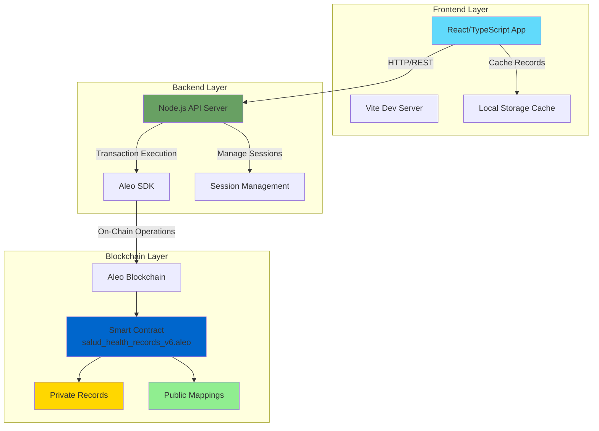
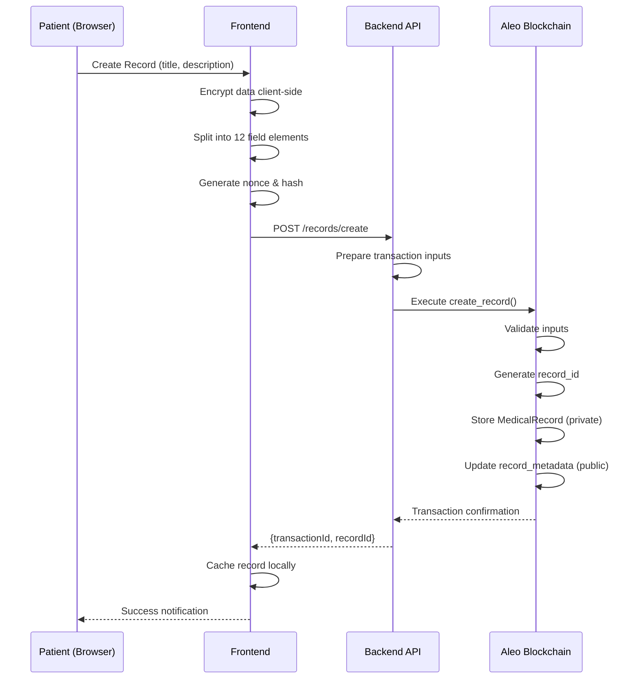
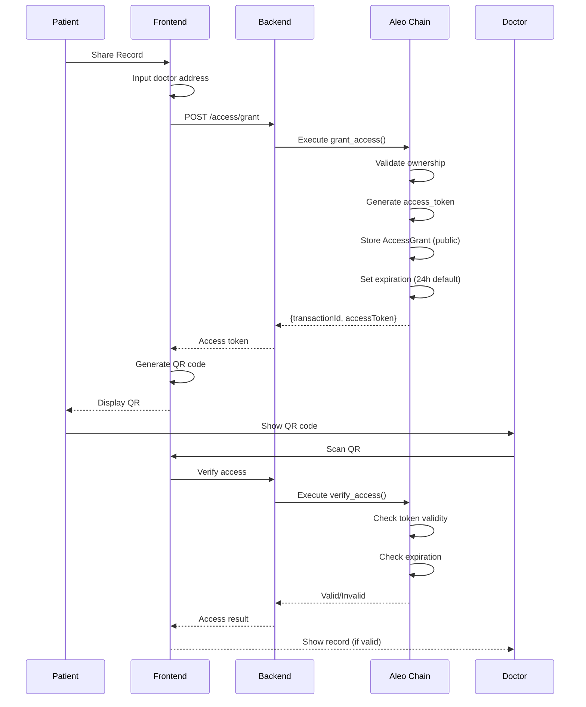

## Architecture Overview

Salud Health is a privacy-preserving medical records management system built on the Aleo blockchain. The platform enables patients to store encrypted health records on-chain and securely share them with healthcare providers using temporary, cryptographically-secured access tokens.

## High-Level Architecture



## Three-Tier Architecture

### 1. Frontend (React + TypeScript)

**Technology Stack:**
- React 18 with TypeScript
- Vite 5.0 (build tool)
- Tailwind CSS (styling)
- Zustand (state management)
- IndexedDB (local caching)

**Key Responsibilities:**
- User interface for patients and doctors
- Client-side data encryption before transmission
- QR code generation and scanning
- Local record caching for performance
- Session state management

**Source Location:** `~/workspace/source/Main APP/`

### 2. Backend API (Node.js)

**Technology Stack:**
- Node.js 18+
- Express.js (REST API)
- Aleo SDK (@provablehq/sdk)
- In-memory session storage

**Key Responsibilities:**
- Wallet connection and session management
- Transaction execution on Aleo blockchain
- Aleo SDK integration
- Record retrieval from blockchain
- Access token validation

**API Endpoints:**
```typescript
POST   /api/wallet/connect        // Connect with private key
POST   /api/wallet/generate       // Generate new Aleo account
GET    /api/wallet/balance/:id    // Get wallet balance
POST   /api/records/create        // Create medical record
GET    /api/records/fetch/:id     // Fetch records from chain
POST   /api/access/grant          // Grant doctor access
GET    /api/health                // Health check
```

**Source Location:** `~/workspace/source/backend/`

### 3. Blockchain Layer (Aleo)

**Smart Contract:** `salud_health_records_v6.aleo`

**Core Components:**

#### Private Records (Patient-Only Visibility)
```leo
record MedicalRecord {
    owner: address,           // Patient's Aleo address
    record_id: field,         // Unique identifier
    data_hash: field,         // Integrity verification
    data_part1-12: field,     // Encrypted medical data (~360 bytes)
    record_type: u8,          // Category (1-10)
    created_at: u32,          // Block height
    version: u8,              // Schema version
}
```

#### Public Mappings (Access Control)
```leo
mapping access_grants: field => AccessGrant;
mapping record_metadata: field => RecordMetadata;
mapping patient_record_count: field => u64;
mapping access_token_valid: field => bool;
```

**Source Location:** `~/workspace/source/Salud Health Contract/src/main.leo`

## Component Communication

### Patient Record Creation Flow



### Doctor Access Grant Flow



## Data Storage Strategy

### On-Chain Storage (Aleo Blockchain)

**Private Records:**
- Medical record data (encrypted, ~360 bytes per record)
- Only accessible by record owner
- Permanent, immutable storage

**Public Mappings:**
- Access grants (who has access to what)
- Record metadata (for discovery)
- Access token validity flags
- Patient record counts

### Off-Chain Storage

**Frontend (IndexedDB):**
- Cached records for fast retrieval
- Session state
- Temporary UI data

**Backend (In-Memory):**
- Active sessions (sessionId → wallet)
- Private keys (session duration only)
- No persistent medical data storage

## Security Architecture

### Multi-Layer Privacy Protection

```
┌─────────────────────────────────────────────────────┐
│ Layer 1: Client-Side Encryption                     │
│ - Data encrypted before leaving browser             │
│ - Encryption key derived from patient wallet        │
└─────────────────────────────────────────────────────┘
                    ↓
┌─────────────────────────────────────────────────────┐
│ Layer 2: Transport Security (HTTPS)                 │
│ - TLS encryption for API communication              │
└─────────────────────────────────────────────────────┘
                    ↓
┌─────────────────────────────────────────────────────┐
│ Layer 3: Blockchain Privacy (Aleo Records)          │
│ - Private records (owner-only visibility)           │
│ - Zero-knowledge proofs for verification            │
└─────────────────────────────────────────────────────┘
                    ↓
┌─────────────────────────────────────────────────────┐
│ Layer 4: Access Control (Smart Contract)            │
│ - Cryptographic access tokens                       │
│ - Time-bound permissions (block height)             │
│ - Revocation capability                             │
└─────────────────────────────────────────────────────┘
```

### Authentication & Authorization

**Patient Authentication:**
1. Private key input
2. Backend creates session
3. Session ID stored in frontend
4. All transactions signed with patient's key

**Doctor Authorization:**
1. QR code contains: `{recordId, accessToken, expiresAt}`
2. Doctor scans QR code
3. System calls `verify_access()` on-chain
4. Smart contract validates:
   - Token exists in `access_grants` mapping
   - Doctor address matches grant
   - Current block height < expiration
   - Grant not revoked

## Scalability Considerations

### Frontend Performance
- Code splitting by route
- Lazy loading for QR scanner (heavy library)
- Local caching with IndexedDB
- Optimistic UI updates

### Backend Performance
- Stateless API design
- Session-based connection pooling
- Async transaction handling
- Connection timeout management

### Blockchain Constraints
- Record size limit: ~360 bytes encrypted per record
- Block time: ~15 seconds
- Transaction fees: paid by patient
- Storage: permanent on-chain

### Workarounds for Large Data

For medical records exceeding 360 bytes:

```typescript
// Strategy 1: Data chunking across multiple records
const chunks = splitDataIntoChunks(largeData, 360);
for (const chunk of chunks) {
  await createRecord(chunk);
}

// Strategy 2: Off-chain storage with on-chain hash
const ipfsHash = await uploadToIPFS(largeData);
await createRecord({ dataHash: ipfsHash, pointer: ipfsCID });
```

## Technology Stack Summary

| Layer | Technology | Purpose |
|-------|------------|----------|
| **Frontend** | React 18 + TypeScript | User interface |
| | Vite 5.0 | Build tooling |
| | Tailwind CSS | Styling |
| | Zustand | State management |
| **Backend** | Node.js 18+ | API server |
| | Express.js | REST API framework |
| | Aleo SDK | Blockchain interaction |
| **Blockchain** | Aleo | Privacy-preserving L1 |
| | Leo Language | Smart contract |
| **Storage** | IndexedDB | Client-side cache |
| | Aleo Records | On-chain private data |
| | Aleo Mappings | On-chain public state |

## Deployment Architecture

### Development Environment
```
Frontend: http://localhost:5173 (Vite dev server)
Backend:  http://localhost:3001 (Node.js)
Blockchain: Aleo Testnet
```

### Production Environment
```
Frontend: Vercel/Netlify (static hosting)
Backend:  Cloud VM or serverless (AWS Lambda, etc.)
Blockchain: Aleo Mainnet
Domain: Custom domain with TLS
```

## Key Design Decisions

### Why Private Key Input?

Salud requires direct private key input (vs. browser wallet connection) because:

1. **Client-side encryption:** Medical data must be encrypted in the browser using the private key before transmission
2. **Zero-knowledge operations:** Cryptographic proofs require direct key access
3. **Access token generation:** Secure token creation needs private key cryptography
4. **HIPAA-grade privacy:** Browser wallets don't expose keys for encryption operations

### Why Backend API?

Despite being a dApp, Salud uses a backend for:

1. **Aleo SDK complexity:** SDK requires Node.js environment
2. **Session management:** Maintains wallet connections
3. **Transaction orchestration:** Simplifies complex multi-step flows
4. **Error handling:** Provides better UX with retry mechanisms

### Why 12 Field Elements?

Medical records use 12 field elements (~360 bytes capacity):

1. **Sufficient for basic records:** Covers most medical notes, prescriptions, lab results
2. **Gas efficiency:** Balance between capacity and transaction cost
3. **Aleo constraints:** Field elements are native to Leo language
4. **Extensibility:** Can create multiple records for larger data

## Further Reading

<CardGroup cols={2}>
  <Card title="Data Flow" href="/architecture/data-flow" icon="arrow-right-arrow-left">
    Detailed data flow diagrams for all operations
  </Card>
  <Card title="Encryption" href="/architecture/encryption" icon="lock">
    Encryption implementation and security details
  </Card>
</CardGroup>