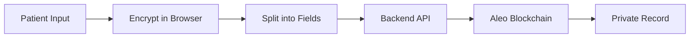

## Overview

Salud Health is built with privacy-first principles using Aleo blockchain's zero-knowledge technology. Your medical data is encrypted end-to-end, and only you control who can access it.

<Info>
  Salud achieves HIPAA-grade encryption through client-side encryption, zero-knowledge proofs, and blockchain-enforced access control.
</Info>

## Privacy Architecture

### Three-Layer Security Model

<Steps>
  <Step title="Client-Side Encryption">
    Data is encrypted in your browser before it ever leaves your device
  </Step>
  
  <Step title="Blockchain Storage">
    Encrypted data is stored as private records on Aleo blockchain
  </Step>
  
  <Step title="Zero-Knowledge Verification">
    Access permissions are verified without revealing medical data
  </Step>
</Steps>

<CardGroup cols={2}>
  <Card title="End-to-End Encryption" icon="lock">
    Data encrypted before leaving your browser, decrypted only by authorized users
  </Card>
  
  <Card title="Zero Server Knowledge" icon="eye-off">
    Backend servers never see your unencrypted medical data
  </Card>
  
  <Card title="Blockchain Immutability" icon="database">
    Records permanently stored with cryptographic integrity
  </Card>
  
  <Card title="Granular Access Control" icon="key">
    You control exactly who can access each record and for how long
  </Card>
</CardGroup>

## Data Flow and Privacy

### Creating a Medical Record



<AccordionGroup>
  <Accordion title="Step 1: Client-Side Encryption">
    Your medical data is encrypted using your private key directly in the browser. The plaintext never leaves your device.
    
    ```typescript
    // Encrypt medical data client-side
    const encryptedData = await encryptWithPatientKey(medicalData);
    const chunks = splitIntoFields(encryptedData); // Split into 4 field elements
    ```
  </Accordion>
  
  <Accordion title="Step 2: Data Chunking">
    Encrypted data is split into Aleo field elements (~253 bits each) for blockchain storage.
    
    **Storage Capacity**: ~126 bytes total across 4 fields
  </Accordion>
  
  <Accordion title="Step 3: Blockchain Transaction">
    The backend facilitates the blockchain transaction, but cannot read the encrypted data.
    
    ```leo
    create_record(
      data_part1, data_part2, data_part3, data_part4,
      record_type,
      data_hash,
      nonce,
      make_discoverable
    )
    ```
  </Accordion>
  
  <Accordion title="Step 4: Private Record Creation">
    The record is stored on Aleo blockchain as a private record, visible only to the owner.
    
    **Result**: Your medical data is now permanently stored on blockchain, encrypted and accessible only by you.
  </Accordion>
</AccordionGroup>

## Privacy Model

### What's Private vs. Public

| Data Type | Visibility | Who Can See |
|-----------|------------|-------------|
| Medical Records | Private | Only the record owner (patient) |
| Encrypted Data Fields | Private | Only owner can decrypt |
| Access Grants | Public | Anyone can verify, but data stays encrypted |
| Access Tokens | Semi-public | Shared via QR code, verifiable on-chain |
| Record Metadata | Optional | Public only if patient opts in |
| Transaction Hashes | Public | Standard blockchain transparency |

<Note>
  Even though access grants are publicly visible on blockchain, they only contain addresses and token hashes - no medical data is exposed.
</Note>

## Encryption Details

### Private Key Security

Your private key is the master key to all your medical records:

<CardGroup cols={2}>
  <Card title="Browser Session Only" icon="clock">
    Private key stored in memory only during active session
  </Card>
  
  <Card title="Never Transmitted" icon="wifi-off">
    Private key never sent over network or stored on servers
  </Card>
  
  <Card title="User-Controlled" icon="user">
    You manage your private key - no password recovery
  </Card>
  
  <Card title="Standard Aleo Format" icon="key">
    Compatible with all Aleo wallets and tools
  </Card>
</CardGroup>

<Warning>
  **NEVER share your private key with anyone!** Anyone with your private key can decrypt all your medical records. Store it securely in a password manager.
</Warning>

### View Key Encryption

When sharing records, view keys enable decryption:

```typescript
// From ShareRecordModal.tsx:120-124
// 1. Generate or retrieve view key for the record
const viewKey = user.viewKey || generateViewKey(user.address);

// 2. Derive doctor's public key from their address
const doctorPublicKey = derivePublicKey(doctorAddress);

// 3. Encrypt view key with doctor's public key
const encryptedViewKey = encryptWithPublicKey(viewKey, doctorPublicKey);
```

**Security Properties:**
- Only the specified doctor can decrypt the view key
- View key is unique per patient
- Encrypted using elliptic curve cryptography
- Included in QR code for seamless sharing

## Access Control

### Time-Limited Access

Access grants automatically expire based on block height:

```leo
// From ARCHITECTURE.md:142-145
const DURATION_BOUNDS = {
  minimum: 240 blocks,    // ~1 hour
  maximum: 40320 blocks,  // ~7 days  
  default: 5760 blocks    // ~24 hours
}
```

<Info>
  Block-based expiration is enforced at the blockchain protocol level and cannot be bypassed, even by malicious actors.
</Info>

### Revocation

You can instantly revoke access before expiration:

```leo
async transition revoke_access(access_token: field) -> Future
```

**Security Guarantees:**
- Only the patient who granted access can revoke it
- Revocation is immediate and irreversible
- Blockchain verifies patient signature
- Doctor loses access in next verification attempt

## Security Features

### Attack Vector Mitigation

<AccordionGroup>
  <Accordion title="Token Prediction Attacks">
    **Mitigation**: Client-provided nonces ensure tokens are unpredictable
    
    ```leo
    transition compute_access_token(
        record_id: field,
        doctor: address,
        patient: address,
        nonce: field  // Random value from client
    ) -> field
    ```
    
    Each access token is unique and cannot be guessed or pre-computed.
  </Accordion>
  
  <Accordion title="Replay Attacks">
    **Mitigation**: Unique tokens per grant, verified against blockchain state
    
    Access tokens are single-use credentials tied to specific record/doctor pairs.
  </Accordion>
  
  <Accordion title="Unauthorized Access">
    **Mitigation**: Multi-layer verification on blockchain
    
    ```leo
    // Checks performed:
    - Record ownership verification
    - Access token exists in mapping
    - Doctor address matches (if specified)
    - Record ID matches
    - Not revoked
    - Not expired (block height check)
    ```
  </Accordion>
  
  <Accordion title="Data Tampering">
    **Mitigation**: Cryptographic hash verification
    
    ```leo
    record MedicalRecord {
      data_hash: field,  // Hash of original data
      // ...
    }
    ```
    
    Any modification to encrypted data will fail hash verification.
  </Accordion>
  
  <Accordion title="Stale Access">
    **Mitigation**: Block height-based automatic expiration
    
    Access is checked against current block height every time:
    ```leo
    assert(current_block_height < grant.expires_at)
    ```
  </Accordion>
</AccordionGroup>

## Blockchain Security

### Aleo's Zero-Knowledge Technology

Salud leverages Aleo's unique privacy features:

<CardGroup cols={2}>
  <Card title="Private Transactions" icon="eye-off">
    Transaction details are hidden using zero-knowledge proofs
  </Card>
  
  <Card title="Private Records" icon="lock">
    Record contents only visible to owner, not other blockchain nodes
  </Card>
  
  <Card title="Public Verification" icon="check-circle">
    Anyone can verify transactions without seeing private data
  </Card>
  
  <Card title="Programmable Privacy" icon="code">
    Smart contract controls precisely what's public vs. private
  </Card>
</CardGroup>

### Smart Contract Security

The Salud smart contract includes several security measures:

```leo
// Prevent self-grants
assert(self.caller != doctor);

// Verify ownership
assert(medical_record.owner == self.caller);

// Enforce duration bounds
let clamped_duration = clamp(duration_blocks, 240u32, 40320u32);

// Compute expiration
let expires_at = current_block + clamped_duration;
```

## Data Integrity

### Hash Verification

Every record includes a hash for integrity checking:

```leo
record MedicalRecord {
    data_hash: field,      // Hash of original data
    data_part1: field,     // Encrypted segment 1
    data_part2: field,     // Encrypted segment 2
    data_part3: field,     // Encrypted segment 3  
    data_part4: field,     // Encrypted segment 4
    // ...
}
```

**Process:**
1. Original data is hashed before encryption
2. Hash is stored in the record
3. Upon decryption, hash is recalculated
4. If hashes don't match, data was tampered with

<Warning>
  If hash verification fails, the record should not be trusted. This indicates data corruption or tampering.
</Warning>

## Privacy Best Practices

### For Patients

<Steps>
  <Step title="Secure Your Private Key">
    - Store in a password manager
    - Never share with anyone
    - Keep backup in secure location
    - Consider hardware wallet for maximum security
  </Step>
  
  <Step title="Minimize Access Duration">
    - Grant shortest access time needed
    - Revoke immediately after appointment
    - Review active grants regularly
  </Step>
  
  <Step title="Verify Doctor Identity">
    - Confirm doctor's Aleo address before sharing
    - Use doctor-specific grants (not generic QR codes)
    - Check blockchain explorer to verify grants
  </Step>
  
  <Step title="Monitor Access">
    - Review Shared Access page regularly
    - Check for unexpected active grants
    - Revoke suspicious or unused access
  </Step>
</Steps>

### For Healthcare Providers

<Steps>
  <Step title="Protect Your Private Key">
    - Use dedicated device for medical records access
    - Never expose private key on shared computers
    - Log out after each session
  </Step>
  
  <Step title="Verify Patient Identity">
    - Confirm patient address matches records
    - Verify QR code is from official Salud app
    - Check expiration time before relying on data
  </Step>
  
  <Step title="Handle Data Responsibly">
    - Don't screenshot or save decrypted data
    - Access records only when necessary
    - Follow HIPAA guidelines for data handling
  </Step>
</Steps>

## Comparison with Traditional Systems

### Salud vs. Centralized EHR

| Feature | Salud (Blockchain) | Traditional EHR |
|---------|-------------------|------------------|
| **Data Control** | Patient-owned | Hospital/provider-owned |
| **Encryption** | End-to-end | Usually at-rest only |
| **Access Control** | Cryptographic | Database permissions |
| **Data Portability** | Fully portable | Locked to system |
| **Single Point of Failure** | No | Yes (central database) |
| **Audit Trail** | Immutable blockchain | Modifiable logs |
| **Privacy** | Zero-knowledge | Trust-based |
| **Interoperability** | Universal (blockchain) | Limited (proprietary) |

<Note>
  While traditional EHRs rely on trusting the system administrator, Salud uses cryptography to enforce privacy - you don't have to trust anyone.
</Note>

## Known Limitations

### Current Security Considerations

<AccordionGroup>
  <Accordion title="Browser-Based Key Storage">
    **Limitation**: Private keys stored in browser memory during session
    
    **Risk**: Browser vulnerabilities could expose keys
    
    **Mitigation**: Keys cleared on disconnect, use trusted browsers, keep browser updated
  </Accordion>
  
  <Accordion title="Client-Side Trust">
    **Limitation**: Frontend code must be trusted
    
    **Risk**: Compromised frontend could steal keys
    
    **Mitigation**: Use official Salud deployment, verify code integrity, open-source transparency
  </Accordion>
  
  <Accordion title="Block Time Variance">
    **Limitation**: Block times are approximate (~15 seconds)
    
    **Risk**: Expiration times may vary slightly
    
    **Mitigation**: Use conservative durations, check blockchain time before relying on access
  </Accordion>
  
  <Accordion title="Limited Record Size">
    **Limitation**: ~126 bytes per record
    
    **Risk**: Large files need multiple records
    
    **Mitigation**: Store file hashes on-chain, actual files in encrypted IPFS/storage
  </Accordion>
</AccordionGroup>

## Security Auditing

### How to Verify Security

<Steps>
  <Step title="Review Open Source Code">
    All Salud code is open source - audit the encryption implementation
  </Step>
  
  <Step title="Check Smart Contract">
    Review the Leo smart contract for security vulnerabilities
  </Step>
  
  <Step title="Verify on Blockchain">
    Use Aleo blockchain explorer to verify records and grants
  </Step>
  
  <Step title="Test in Demo Mode">
    Try the system in demo mode before using with real data
  </Step>
</Steps>

### Blockchain Explorer

Verify your records and access grants on-chain:

- **Testnet Explorer**: https://explorer.aleo.org/
- **Search by**: Address, transaction hash, or record ID
- **Verify**: Record creation, access grants, revocations

<Info>
  All blockchain transactions are publicly verifiable, but medical data remains encrypted and private.
</Info>

## Compliance and Standards

### Privacy Regulations

Salud's architecture supports compliance with:

<CardGroup cols={2}>
  <Card title="HIPAA" icon="shield-check">
    End-to-end encryption and access controls meet HIPAA technical safeguards
  </Card>
  
  <Card title="GDPR" icon="globe">
    Patient data ownership and right to revoke access align with GDPR
  </Card>
  
  <Card title="21 CFR Part 11" icon="file-text">
    Blockchain audit trail provides required record-keeping
  </Card>
  
  <Card title="SOC 2" icon="lock">
    Cryptographic access controls and audit logs support SOC 2 compliance
  </Card>
</CardGroup>

<Warning>
  While Salud's technology supports compliance, organizations must still implement proper policies and procedures. Consult legal counsel for your specific jurisdiction.
</Warning>

## Future Security Enhancements

Planned security improvements:

- **Hardware Wallet Integration**: Support for Ledger/Trezor for key storage
- **Multi-Signature Records**: Require multiple approvals for sensitive data
- **Biometric Authentication**: Fingerprint/FaceID for access
- **Zero-Knowledge Proofs**: Prove record attributes without revealing data
- **Decentralized Identity**: Integration with DID standards

## Get Help

<CardGroup cols={2}>
  <Card title="Report Security Issue" icon="alert-triangle">
    Found a vulnerability? Email security@salud.health
  </Card>
  
  <Card title="Community Support" icon="message-circle">
    Join Aleo Discord for privacy-tech discussions
  </Card>
</CardGroup>